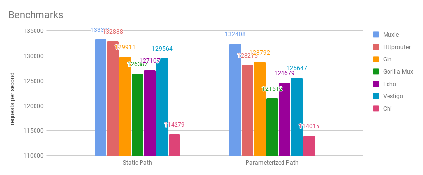

<h1 align="center">Muxie</h1>

<div align="center">
  :steam_locomotive::train::train::train::train::train:
</div>
<div align="center">
  <strong>Fast trie implementation designed from scratch specifically for HTTP</strong>
</div>
<div align="center">
  A <code>small and light</code> router for creating sturdy backend <a href="https://golang.org" alt="Go Programming Language">Go</a> applications. Production-level tested, muxie's capabilities live inside the well-tested <a href="https://iris-go.com">Iris </a> web framework.
</div>

<br />

<div align="center">
  <!-- Release -->
  <a href="https://github.com/kataras/muxie/releases">
    
  </a>
  <!-- Godocs -->
  <a href="https://godoc.org/github.com/kataras/muxie">
    
  </a>
  <!-- Build Status -->
  <a href="https://travis-ci.org/kataras/muxie">
    
  </a>
  <!-- Report Card -->
  <a href="https://goreportcard.com/report/github.com/kataras/muxie">
    
  </a>
  <!-- Examples -->
  <a href="https://github.com/kataras/muxie/tree/master/_examples">
    
  </a>
  <!-- Built for Iris -->
  <a href="https://github.com/kataras/iris">
    
  </a>
</div>

<div align="center">
  <sub>The little router that could. Built with ❤︎ by
  <a href="https://twitter.com/MakisMaropoulos">Gerasimos Maropoulos</a>
</div>

[](_benchmarks)
[](https://app.fossa.io/projects/git%2Bgithub.com%2Fkataras%2Fmuxie?ref=badge_shield)

_Last updated on October 17, 2018._ Click [here](_benchmarks/README.md) to read more details.

## Features

- __trie based:__ [performance](_benchmarks/README.md) and useness are first class citizens, Muxie is based on the prefix tree data structure, designed from scratch and built for HTTP, and it is among the fastest outhere, if not the fastest one
- __grouping:__ group common routes based on their path prefixes
- __no external dependencies:__ weighing `30kb`, Muxie is a tiny little library without external dependencies
- __closest wildcard resolution and prefix-based custom 404:__ wildcards, named parameters and static paths can all live and play together nice and fast in the same path prefix or suffix(!)
- __small api:__ with only 3 main methods for HTTP there's not much to learn
- __compatibility:__ built to be 100% compatible with the `net/http` standard package

## Technical Features

- [x] Closest Wildcard Resolution and Root wildcard (CWR)[*](_examples/3_root_wildcard_and_custom_404/main.go)
- [x] Parameterized Dynamic Path (named parameters with `:name` and wildcards with `*name`, can play all together for the same path prefix|suffix)[*](_examples/2_parameterized/main.go)
- [x] Standard handlers chain (`Pre(handlers).For(mainHandler)` for individual routes and `Mux#Use` for router)[*](_examples/6_middleware/main.go)
- [x] Register handlers by method(s) (`muxie.Methods()`)[*](_examples/7_by_methods/main.go)
- [x] Register handlers by filters (`Mux#HandleRequest` and `Mux#AddRequestHandler` for  `muxie.Matcher` and `muxie.RequestHandler`)
- [x] Handle subdomains with ease (`muxie.Host` Matcher)[*](_examples/9_subdomains_and_matchers)
- [x] Request Processors (`muxie.Bind` and `muxie.Dispatch`)[*](_examples/8_bind_req_send_resp)

Interested? Want to learn more about this library? Check out our tiny [examples](_examples) and the simple [godocs page](https://godoc.org/github.com/kataras/muxie).

## Installation

The only requirement is the [Go Programming Language](https://golang.org/dl/)

```sh
$ go get -u github.com/kataras/muxie
```

<!-- ## Philosophy

I believe that providing the right tools for the right job represents my best self
and I really enjoy writing small libraries and even frameworks that can be used and learnt by thousands like me.
I do it for the past two and a half years and I couldn't be more happy and proud for myself.

[Iris](https://github.com/kataras/iris) is a web backend framework for Go that is well-known in the Go community,
some of you hated it due to a "battle" between "competitors" followed by a single article written almost three years ago but the majority of you really love it so much that you recommend it to your co-workers, use it inside your companies, startups or your client's projects or even write your postgraduate dissertation based on your own experience with Iris. Both categories of fans
gave me enough reasons to continue and overcome myself day by day.

It was about the first days of September(2018) that I decided to start working on the next Iris release(version 11) and all job interviews postponed indefinitely.
If you have ever seen or hear about Iris, you already know that Iris is one of the fastest and easy-to-use frameworks, this is why it became so famous in so little time after all. 

A lot improvements were pushed over a month+ working full-time on Iris.
I have never seen a router or a framework supports so many patterns as the current Iris' internal router that is exposed by a beautiful API. However, I couldn't release it for the public yet, I felt that something was missing, I believed that I could do its router smarter and even faster(!) and that ate my guts. And then...in early October, after a lot of testing(and drinking) I found the missing part, it was that the routes' parameterized paths, wildcards and statics all-together for the same path prefix cannot play as fast as possible and good as they should, also I realised that the internal router's code was not the best ever written (it was written to be extremely fast and I didn't care about readability so much back then, when I finally made it to work faster than the rest I forgot to "prettify" it due to my excitement!)

Initially the `trie.go` and `node.go` were written for the Iris web framework's version 11 as you can understand by now, I believe that programming should be fun and not stressful, especially for new Gophers. So here we are, introducing a new autonomous Go-based mux(router) that it is light, fast and easy to use for all Gophers, not just for Iris users/developers.

The `kataras/muxie` repository contains the full source code of my trie implementation and the HTTP component(`muxie.NewMux()`) which is fully compatible with the `net/http` package. Users of this package are not limited on HTTP, they can use it to store and search simple key-value data into their programs (`muxie.NewTrie()`).


- The trie implementation is easy to read, and if it is not for you please send me a message to explain to you personally
- The API is simple, just three main methods and the two of them are the well-known `Handle` and `HandleFunc`, identically to the std package's `net/http#ServeMux`
- Implements a way to store parameters without touching the `*http.Request` and change the standard handler definition by introducing a new type such as a Context or slow the whole HTTP serve process because of it, look the `GetParam` function and the internal `paramsWriter` structure that it is created and used inside the `Mux#ServeHTTP`
- Besides the HTTP main functionality that this package offers, users should be able to use it for other things as well, the API is exposed as much as you walk through to
- Supports named parameters and wildcards of course
- Supports static path segments(parts, nodes) and named parameters and wildcards for the same path prefix without losing a bit of performance, unlike others that by-design they can't even do it

For the hesitants: There is a [public repository](https://github.com/kataras/trie-examples-to-remember-again) (previously private) that you can follow the whole process of coding and designing until the final result of `kataras/muxie`'s.

And... never forget to put some fun in your life ❤︎

Yours,<br />
Gerasimos Maropoulos ([@MakisMaropoulos](https://twitter.com/MakisMaropoulos)) -->

## License

[MIT](https://tldrlegal.com/license/mit-license)

[](https://app.fossa.io/projects/git%2Bgithub.com%2Fkataras%2Fmuxie?ref=badge_large)