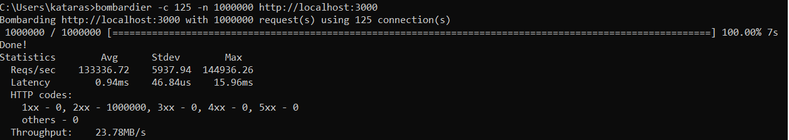
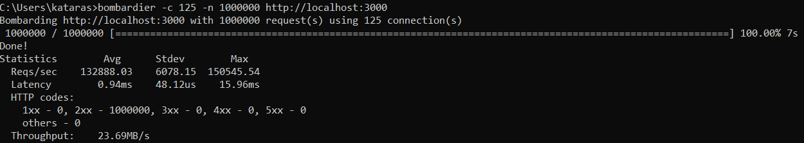
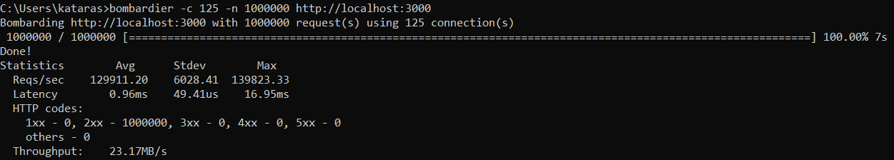
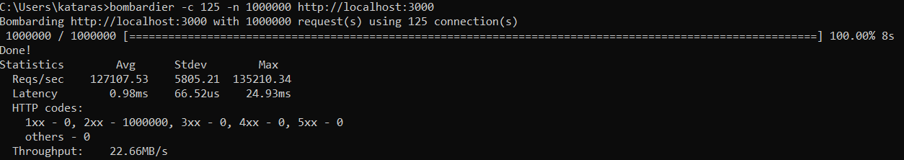
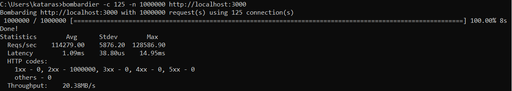
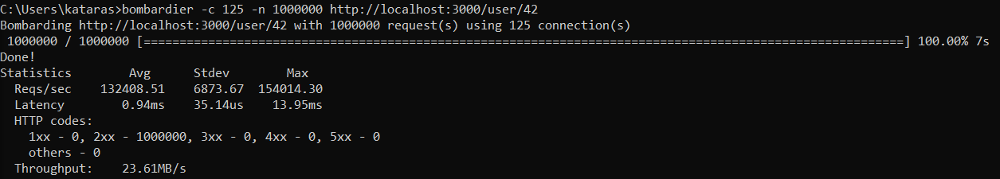
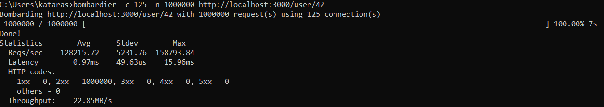
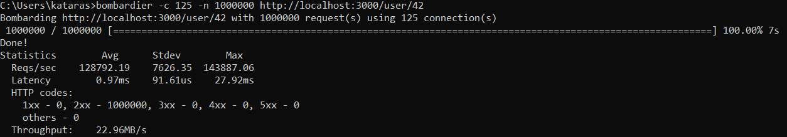
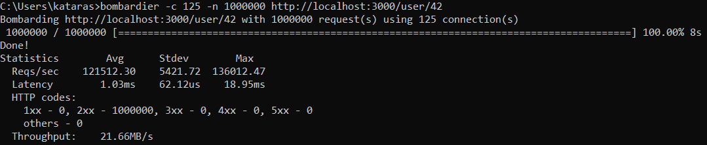
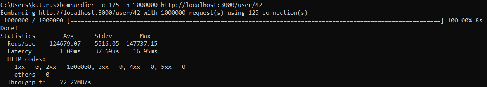

Higher is better.

Last updated on October 17, 2018.

> October 16 & 17: add echo, vestigo and chi benchmarks against the same environments

> October 15: benchmark between muxie, httprouter, gin and gorilla mux

## Hardware

* Processor: Intel(R) Core(TM) **i7-8750H** CPU @ 2.20GHz 2.20GHz
* RAM: **16.00 GB**

## Software

* OS: Microsoft **Windows 10** [Version 1803 (OS Build 17134.345)]
* HTTP Benchmark Tool: https://github.com/codesenberg/bombardier, latest version **1.2.0**
* Go Version: 1.11.1
* **muxie**: https://github.com/kataras/muxie, latest version **1.0.0**
    * Bench code: [muxie/main.go](muxie/main.go)
* **httprouter**: https://github.com/julienschmidt/httprouter, latest version **1.2.0**
    * Bench code: [httprouter/main.go](httprouter/main.go)
* **gin**: https://github.com/gin-gonic/gin, latest version **1.3.0**
    * Bench code: [gin/main.go](gin/main.go)
* **gorilla mux**: https://github.com/gorilla/mux, latest version **1.6.2**
    * Bench code: [gorilla-mux/main.go](gorilla-mux/main.go)
* **echo**: https://github.com/labstack/echo, latest version **3.3.6**
    * Bench code: [echo/main.go](echo/main.go)
* **vestigo**: https://github.com/husobee/vestigo, latest version **1.1.0**
    * Bench code: [vestigo/main.go](vestigo/main.go)
* **chi**: https://github.com/go-chi/chi, latest version **3.3.3**
    * Bench code: [chi/main.go](chi/main.go)

## Results

### Static Path

```sh
bombardier -c 125 -n 1000000 http://localhost:3000
```

#### Muxie



#### Httprouter



#### Gin



#### Gorilla Mux


#### Echo



#### Vestigo


#### Chi



### Parameterized (dynamic) Path

```sh
bombardier -c 125 -n 1000000 http://localhost:3000/user/42
```

#### Muxie



#### Httprouter



#### Gin



#### Gorilla Mux



#### Echo



#### Vestigo


#### Chi

